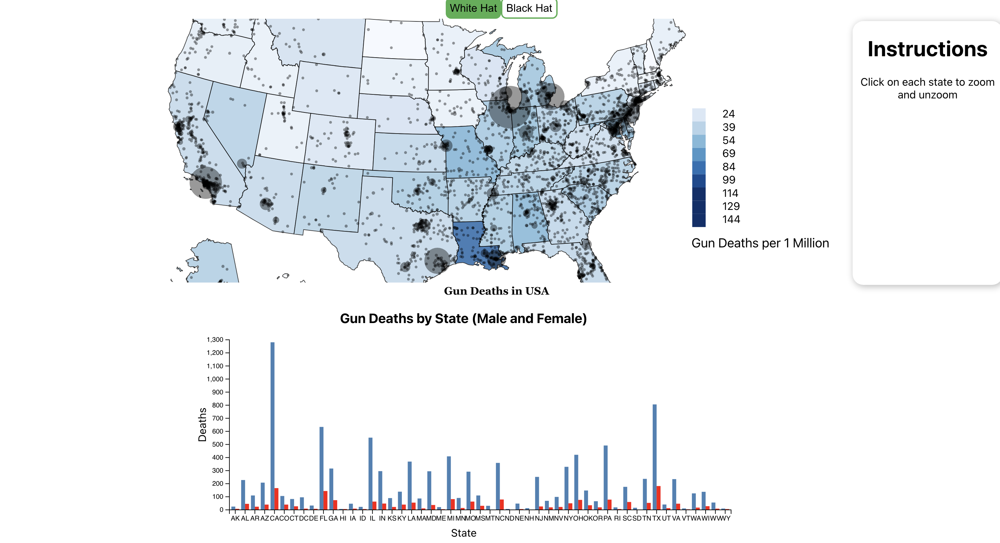

# StateGunDeathVisualization
## Homework 1

### Srikanth Kyatham [UIN - 663943205]

### Environment:
**OS** : Mac OS

### PreRequisites:
- Python
- JS
- React
- D3
- 
### Homework Problem :
White Hat Visualization: https://github.com/uic-evl/CS529HW1

### Changes made for White Hat Visualization :

I adjusted the color mapping based on the number of gun deaths per 1 million population. This alteration allows users to quickly grasp the variation in gun deaths across different states, with a color gradient ranging from lighter to darker shades of blue. This improved encoding enhances the user's ability to understand the data intuitively. I enhanced the tooltips to display more detailed information, including the state name, total gun deaths, population, and gender-specific death counts.

The white-hat nature of this visualization lies in its commitment to clarity, transparency, and user engagement. The color mapping and interactive features aim to empower users to explore the data and understand the underlying patterns while maintaining ethical considerations. Additionally, the inclusion of tooltips and brushing functionality ensures that users have access to relevant information without overwhelming them with details, contributing to a responsible and informative data visualization.

### Map Visualization :

### Instructions to Run React App :
1. clone the github repo
2. Install the required npm packages inside project directory:
  > npm install
3. Run the program
  >npm start

It will automatically launch a browser view to localhost:3000 (or similar) .

### Source Credits :
1. State map: https://eric.clst.org/tech/usgeojson/
2. Original state population: US Census:  https://www.census.gov/data/tables/time-series/demo/popest/2010s-state-total.html
3. Original Slate gun violence dataset:
   https://www.slate.com/articles/news_and_politics/crime/2012/12/gun_death_tally_every_american_gun_death_since_newtown_sandy_hook_shooting.html
